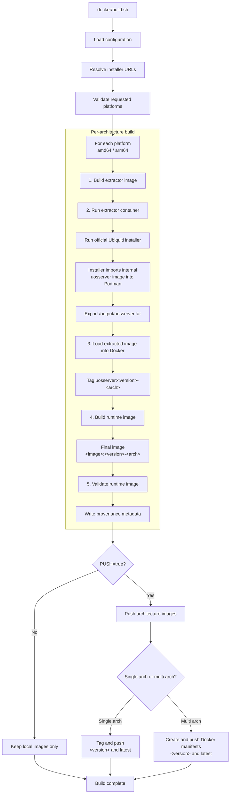

<p align="center">
  
</p>

<h1 align="center">UniFi OS Server for Docker Compose</h1>

<p align="center">
  Run UniFi OS Server in a Docker container with persistent storage, systemd support, and multi-architecture images.
</p>

<p align="center">
  <a href="https://github.com/Gill-Bates/unifi-os-server/releases">
    
  </a>
  <a href="https://github.com/Gill-Bates/unifi-os-server/actions/workflows/docker-build.yml">
    
  </a>
  <a href="https://github.com/Gill-Bates/unifi-os-server/actions/workflows/check-updates.yml">
    
  </a>
  <a href="https://hub.docker.com/r/giiibates/unifi-os-server">
    
  </a>
</p>

---

## Overview

This repository provides a Docker Compose setup for running **UniFi OS Server** on a Linux host.

The image is built from the official UniFi OS Server software distributed by Ubiquiti. The included Compose file contains the required runtime settings for systemd, persistent storage, capabilities, temporary filesystems, and exposed ports.

For normal use, start with:

```text
docker-compose.yaml
```

---

## Security Notice

> [!WARNING]
> Trivy scans may report **HIGH** or **CRITICAL** vulnerabilities in this image.
>
> This project packages the official UniFi OS Server software from Ubiquiti. Many findings originate from upstream vendor components and cannot be fixed directly in this repository.
>
> Security fixes must come from Ubiquiti upstream releases and can only be included here after a new upstream version is available.

---


## Requirements

- Linux host
- Docker Engine
- Docker Compose plugin
- Free host ports for UniFi OS Server
- Persistent storage for UniFi data

Check Docker Compose availability:

```bash
docker compose version
```

---

## Technical Build Flow

<details>
<summary><strong>Build flow from <code>docker/build.sh</code></strong></summary>

The build script loads configuration, resolves the official UniFi OS Server installer URLs, builds one image per requested architecture, validates the runtime image, and optionally publishes architecture images and multi-architecture manifests.



</details>

<details>
<summary><strong>Extraction architecture</strong></summary>

This view shows how the official Ubiquiti installer is executed inside the extractor container and how the internal <code>uosserver</code> image becomes the final runtime image.



</details>

```mermaid
flowchart TB
  subgraph HOST["Docker host / CI runner"]
    A["docker/build.sh"] --> B["Dockerfile.extractor"]
    B --> C["Extractor image"]

    subgraph EXTRACTOR["Extractor container"]
      C --> D["Official UniFi OS Server installer"]
      D --> E["Installer runs non-interactively"]
      E --> F["Podman storage"]
      F --> G["Internal uosserver image"]
      G --> H["Exported archive<br/>/output/uosserver.tar"]
    end

    H --> I["docker load"]
    I --> J["Extracted base image<br/>uosserver:&lt;version&gt;-&lt;arch&gt;"]

    J --> K["Dockerfile.runtime"]
    K --> L["Runtime image<br/>&lt;image&gt;:&lt;version&gt;-&lt;arch&gt;"]

    L --> M["Runtime validation"]
    M --> N["Push arch image"]
    N --> O["Multi-arch manifest<br/>&lt;version&gt; and latest"]
  end
```

## Quick Start

### 1. Clone or enter the project directory

```bash
cd unifi-os-server
```

### 2. Create persistent data directories

```bash
mkdir -p data/{persistent,var-log,data,srv,var-lib-unifi,var-lib-mongodb,etc-rabbitmq-ssl}
```

### 3. Configure `UOS_SYSTEM_IP`

Edit `docker-compose.yaml` and set the address that UniFi devices should use to reach this server.

Example:

```yaml
environment:
  - UOS_SYSTEM_IP=unifi.example.com
```

You can use either a DNS name or an IP address.

### 4. Start UniFi OS Server

```bash
docker compose up -d
```

### 5. Open the web interface

```text
https://<your-host>:11443
```

---

## Runtime Settings

The provided `docker-compose.yaml` already includes the required runtime settings.

These settings are required for UniFi OS Server to start and shut down correctly:

- `cgroup: host`
- `NET_RAW`
- `NET_ADMIN`
- systemd-compatible `tmpfs` mounts
- persistent data mounts under `./data/...`
- correct stop signal handling
- required TCP and UDP port mappings

Do not remove these settings unless you know exactly which UniFi OS component no longer needs them.

---

## Important Environment Variables

### `UOS_SYSTEM_IP`

Address used by UniFi devices and controllers to reach the server.

Example:

```yaml
environment:
  - UOS_SYSTEM_IP=unifi.example.com
```

### `HARDWARE_PLATFORM`

Optional setting for Synology-specific runtime patches.

Example:

```yaml
environment:
  - HARDWARE_PLATFORM=synology
```

Use this only when running on Synology hardware or when the documented Synology patch behavior is required.

---

## Ports

The Compose file already defines the required port mappings.

Commonly used ports:

| Port | Protocol | Purpose |
|---:|:---:|---|
| `11443` | TCP | UniFi OS web interface |
| `8080` | TCP | Device communication |
| `8443` | TCP | UniFi Network application |
| `3478` | UDP | STUN and adoption |
| `10003` | UDP | Device discovery |

Optional services may expose additional ports depending on your UniFi setup.

Unused optional mappings can be removed from `docker-compose.yaml`.

---

## Updating

Pull the latest image and recreate the container:

```bash
docker compose pull
docker compose up -d
```

Persistent data under `./data/...` remains intact.

---

## Stopping

Stop the container:

```bash
docker compose down
```

This does not delete persistent data.

---

## Troubleshooting

### Device adoption does not work

Check the following:

- `UOS_SYSTEM_IP` points to the correct reachable hostname or IP address
- `8080/tcp` is reachable from the device network
- `3478/udp` is not blocked by a firewall or NAT
- `10003/udp` is available if discovery is required
- the host firewall allows the mapped ports

### Web interface is not reachable

Check container status:

```bash
docker compose ps
```

Check logs:

```bash
docker compose logs -f
```

Verify that the host port is listening:

```bash
ss -tulpen | grep 11443
```

---

## Data Persistence

Persistent data is stored below:

```text
./data/
```

Do not delete this directory unless you intentionally want to reset UniFi OS Server data.

Recommended backup target:

```text
./data/
```

---

## Disclaimer

This project is not affiliated with, endorsed by, or sponsored by Ubiquiti Inc. UniFi and Ubiquiti are trademarks or registered trademarks of Ubiquiti Inc.

---

## License

See [LICENSE](LICENSE).
