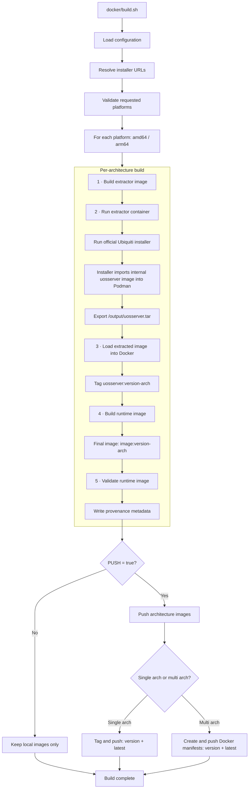
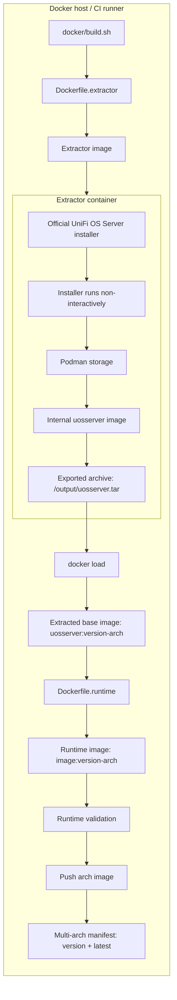

<p align="center">
  
</p>

<h1 align="center">UniFi OS Server for Docker Compose</h1>

<p align="center">
  Run UniFi OS Server in a Docker container with persistent storage, systemd support, and multi-architecture images.
</p>

<p align="center">
  <a href="https://github.com/Gill-Bates/unifi-os-server/releases">
    
  </a>
  <a href="https://github.com/Gill-Bates/unifi-os-server/actions/workflows/docker-build.yml">
    
  </a>
  <a href="https://github.com/Gill-Bates/unifi-os-server/actions/workflows/check-updates.yml">
    
  </a>
  <a href="https://hub.docker.com/r/giiibates/unifi-os-server">
    
  </a>
</p>

---

## Overview

This repository provides a Docker Compose setup for running **UniFi OS Server** on a Linux host.

The image is built from the official UniFi OS Server software distributed by Ubiquiti. The included Compose file contains the required runtime settings for systemd, persistent storage, capabilities, temporary filesystems, and exposed ports.

For normal use, start with:

```text
docker-compose.yaml
```

---

## Security Notice

> [!WARNING]
> Trivy scans may report **HIGH** or **CRITICAL** vulnerabilities in this image.
>
> This project packages the official UniFi OS Server software from Ubiquiti. Many findings originate from upstream vendor components and cannot be fixed directly in this repository.
>
> Security fixes must come from Ubiquiti upstream releases and can only be included here after a new upstream version is available.
>
> *Update Jun 10, 2026:
> We have reviewed the information you provided and discussed the findings internally with our development team. The issue has been reported to the responsible teams, and fixes for the affected packages are planned for a future UniFi OS Server release.*
---

## Requirements

- Linux host
- Docker Engine
- Docker Compose plugin
- Free host ports for UniFi OS Server
- Persistent storage for UniFi data

Check Docker Compose availability:

```bash
docker compose version
```

---

## Technical Build Flow

<details>
<summary><strong>Build flow from <code>docker/build.sh</code></strong></summary>

<br>

The build script loads configuration, resolves the official UniFi OS Server installer URLs, builds one image per requested architecture, validates the runtime image, and optionally publishes architecture images and multi-architecture manifests.



</details>

<details>
<summary><strong>Extraction architecture</strong></summary>

<br>

This view shows how the official Ubiquiti installer is executed inside the extractor container and how the internal <code>uosserver</code> image becomes the final runtime image.



</details>

---

## Quick Start

### 1. Clone or enter the project directory

```bash
cd unifi-os-server
```

### 2. Create persistent data directories

```bash
mkdir -p data/{persistent,var-log,data,srv,var-lib-unifi,var-lib-postgresql,var-lib-mongodb,etc-rabbitmq-ssl}
```

### 3. Configure `UOS_SYSTEM_IP`

Edit `docker-compose.yaml` and set the address that UniFi devices should use to reach this server.

```yaml
environment:
  - UOS_SYSTEM_IP=unifi.example.com
```

You can use either a DNS name or an IP address.

### 4. Start UniFi OS Server

```bash
docker compose up -d
```

### 5. Open the web interface

```text
https://<your-host>:11443
```

---

## Runtime Settings

The provided `docker-compose.yaml` already includes the required runtime settings.

| Setting | Value | Why it's needed |
|---|---|---|
| `cgroup` | `host` | systemd requires access to the host cgroup hierarchy |
| `cap_add` | `NET_RAW`, `NET_ADMIN` | Required for network configuration and device adoption |
| `tmpfs` | `/run`, `/run/lock`, `/tmp`, `/var/opt/unifi/tmp` | systemd and UniFi services need writable in-memory paths at startup |
| `volumes` | `/sys/fs/cgroup:/sys/fs/cgroup:rw` | Direct cgroup mount required by systemd inside the container |
| `volumes` | `./data/...` | Persistent storage — data survives container recreation |
| `stop_signal` | `SIGRTMIN+3` | Tells systemd to shut down cleanly instead of being force-killed |

> Do not remove these settings unless you know exactly which UniFi OS component no longer needs them.

---

## Important Environment Variables

| Variable | Default | Required | Description |
|---|:---:|:---:|---|
| `UOS_SYSTEM_IP` | — | ✔ | Address (hostname or IP) that UniFi devices use to reach this server. Example: `unifi.example.com` |
| `UOS_SHOW_JOURNAL` | `false` | | Forward the full systemd journal to `docker logs`. Set to `true` for verbose service logs. |
| `UOS_UUID` | auto | | Fixed UUIDv5 identifier for this instance. Useful when the identity must survive container recreation without a persistent `/data` mount. Must match format `xxxxxxxx-xxxx-5xxx-[89ab]xxx-xxxxxxxxxxxx`. An invalid value aborts startup. |
| `HARDWARE_PLATFORM` | — | | Set to `synology` to enable Synology-specific runtime patches. Only required on Synology hardware. |

---

## Ports

The Compose file already defines the required port mappings.

Commonly used ports:

| Port | Protocol | Required | Purpose |
|---:|:---:|:---:|---|
| `11443` | TCP | ✔ | UniFi OS web interface |
| `8080` | TCP | ✔ | Device communication |
| `8443` | TCP | ✔ | UniFi Network application |
| `3478` | UDP | ✔ | STUN and adoption |
| `10003` | UDP | | Device discovery |

Optional services may expose additional ports depending on your UniFi setup. Unused optional mappings can be removed from `docker-compose.yaml`.

---

## Updating

Pull the latest image and recreate the container:

```bash
docker compose pull
docker compose up -d
```

Persistent data under `./data/...` remains intact.

---

## Stopping

Stop the container:

```bash
docker compose down
```

This does not delete persistent data.

---

## Troubleshooting

Start with the built-in diagnostic tool — it covers most common failure scenarios:

```bash
docker exec -it <container_name> diagnostics
```

It checks services, databases, ports, disk space, volume mounts, and recent journal errors. Exit code `0` means all checks passed.

For issues the tool doesn't resolve:

| Symptom | What to check |
|---|---|
| Device adoption fails | `UOS_SYSTEM_IP` set and reachable; `8080/tcp`, `3478/udp` not blocked by firewall or NAT |
| Web interface unreachable | `docker compose ps`; `docker compose logs -f`; `ss -tulpen \| grep 11443` |

---

## Disclaimer

This project is not affiliated with, endorsed by, or sponsored by Ubiquiti Inc. UniFi and Ubiquiti are trademarks or registered trademarks of Ubiquiti Inc.

---

## License

See [LICENSE](LICENSE).
